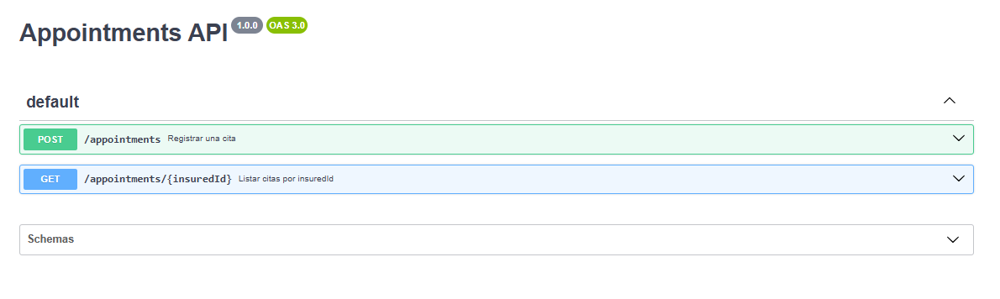

# Appointments API

## Descripción
Este proyecto implementa una API para la gestión de citas (appointments) en AWS, utilizando Node.js, Express, Serverless Framework y AWS Lambda. Permite registrar citas, consultar citas por asegurado y actualizar el status de una cita mediante mensajes SQS. Además, publica eventos en SNS al registrar una cita.

## Arquitectura
- **AWS Lambda** para ejecución serverless.
- **DynamoDB** como base de datos para almacenar citas.
- **SNS** para publicar eventos al registrar una cita.
- **SQS** para procesar la actualización de status de citas de forma asíncrona.
- **Serverless Framework** para despliegue y desarrollo local.

## Endpoints HTTP
- `POST /appointments`: Registrar una nueva cita.
- `GET /appointments/{insuredId}`: Obtener citas por ID de asegurado.

> **Nota:** La actualización de status de una cita **no** se realiza por HTTP, sino mediante mensajes enviados a una cola SQS.

## Actualización de status vía SQS
Para actualizar el status de una cita, envía un mensaje a la cola SQS configurada con el siguiente formato:

```json
{
  "insuredId": "00145",
  "scheduleId": 45120251012163010,
  "status": "completed"
}
```

El handler procesa estos mensajes y actualiza el status en DynamoDB.

## Evento SNS al registrar cita
Al registrar una cita, se publica automáticamente un mensaje en un SNS Topic con el siguiente formato:

```json
{
  "event": "AppointmentCreated",
  "data": {
    "insuredId": "00145",
    "scheduleId": 45120251012163010,
    "countryISO": "PE",
    "status": "pending"
  }
}
```

## Modelo de datos
- **Appointment**
  - `insuredId`: string (5 dígitos)
  - `scheduleId`: number
  - `countryISO`: 'PE' | 'CL'
  - `status`: string

## Despliegue y ejecución local

### Requisitos
- Node.js >= 18
- AWS CLI configurado
- Serverless Framework (`npm install -g serverless`)

### Instalación
```sh
npm install
```

### Ejecución local
```sh
npx serverless offline
```

### Despliegue en AWS
```sh
npx serverless deploy
```

## Documentación Swagger

Swagger:


Registrar una cita:


Obtener cita por asegurado:


Entidad cita:


## Estructura principal del proyecto
- `src/domain/entities/Appointment.ts`: Entidad principal de cita
- `src/infrastructure/database/DynamoAppointmentRepository.ts`: Persistencia en DynamoDB
- `src/application/use-cases/`: Casos de uso (registro, consulta, actualización)
- `src/application/services/AppointmentServiceImpl.ts`: Servicio principal
- `src/infrastructure/presentation/sqs/processAppointmentFromSqs.ts`: Handler de SQS para actualización de status
- `src/application/use-cases/AppointmentSnsPublisher.ts`: Publicación en SNS

## Pruebas
El proyecto incluye pruebas unitarias para el controller.

Ejecución del comando de pruebas:


Reporte de pruebas:


## Iniciar la aplicación
Registrar una cita: https://3knxd8tkra.execute-api.us-east-1.amazonaws.com/appointments


Obtener cita por asegurado: https://3knxd8tkra.execute-api.us-east-1.amazonaws.com/appointments/00143


---
Autor: Eduardo Almaraz García
